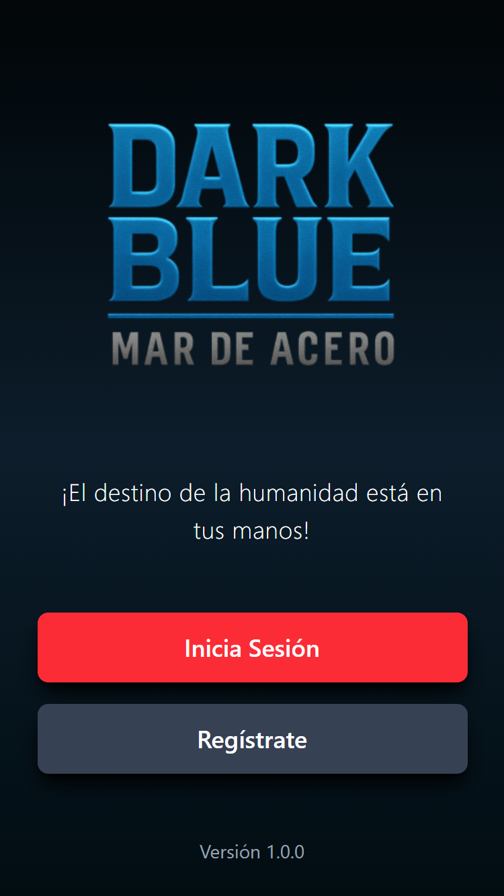
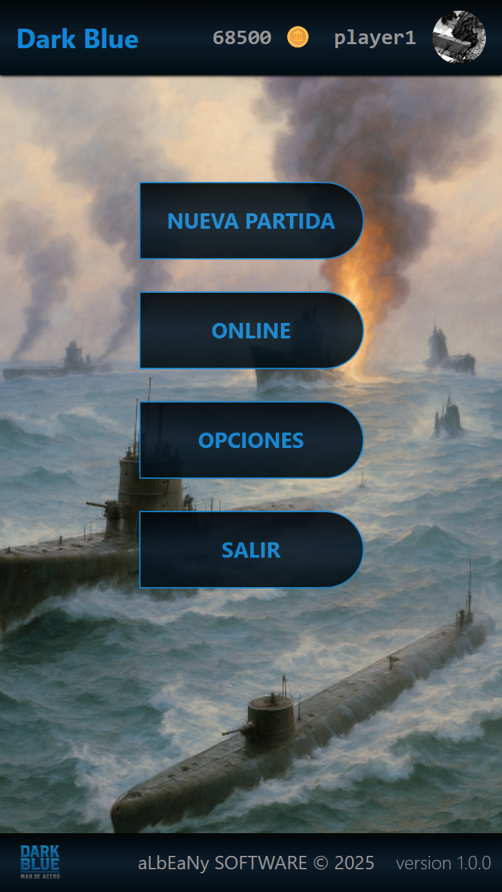
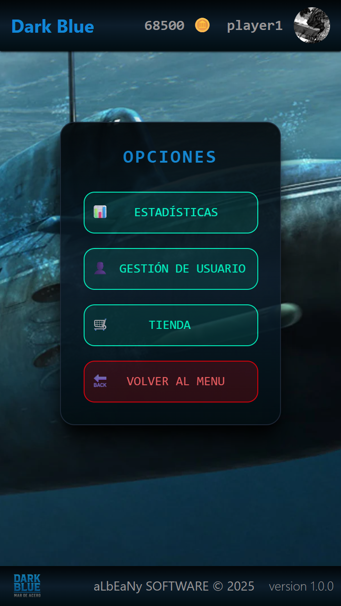
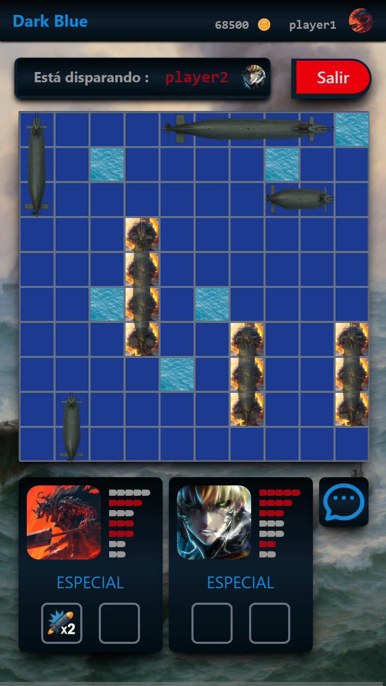

### &nbsp;&nbsp;*¡El destino de la humanidad está en tus manos! -   Una batalla épica bajo el del mar*
---
<h2 style="color: #3bfa; font-size: 22px;">
Descripción del Proyecto
</h2>

&nbsp;&nbsp;**Dark Blue: Mar de Acero** es un videojuego web inspirado en el clásico *"Hundir la Flota"*, reinventado y ambientado en un futuro distópico en guerra entre humanos y máquinas.

&nbsp;&nbsp;El jugador puede enfrentarse a:

- 🤖 **Un servicio de lógica para los disparos de IA en modo campaña**
- 🌐 **Otros jugadores en tiempo real (player vs player) online**

&nbsp;&nbsp;El título ofrece:

- Tableros dinámicos
- Ataques especiales
- Chat integrado
- Animaciones
- Progresión completa del perfil
- Tienda online con créditos virtuales

&nbsp;&nbsp;El proyecto está dividido en:

- **Backend**: Spring Boot 3.5 + MongoDB + servicio de archivos multimedia
- **Frontend**: Angular 19

---

<h2 style="color: #3bfa; font-size: 22px;">
Tecnologías Principales
</h2>

## &nbsp;🛠 Backend
- **Java 17**
- **Spring Boot 3.5**
- Spring Security JWT
- Spring WebSocket (STOMP)
- Spring Data MongoDB
- WebFlux
- Static Resources
- Lombok
- Jakarta Validation
- Spring Mail
- Maven

## &nbsp;🎨 Frontend
- **Angular 19**
- Angular Signals
- RxJS
- Tailwind CSS 4
- SweetAlert2
- STOMP
- Animaciones CSS
- Media service (Frontend y Backend)

---
<h2 style="color: #3bfa; font-size: 22px;">
Funcionalidades Principales
</h2>

## &nbsp;🔐 Autenticación y Seguridad
- Registro con doble factor de autenticación (2FA sobre email)
- Login con JWT
- Recuperación de contraseña con (2FA sobre email)
- Eliminación de cuenta
---

## &nbsp;🧑‍💻 Perfil del Jugador
- Nivel y experiencia
- Créditos virtuales
- Estadísticas completas
- Ajustes de perfil, nickname y avatar
- Inventario de artículos

---

## &nbsp;🤖 Modo Campaña (Player vs IA)
- Servicio con lógica inteligente con priorización de objetivos
- Disparos progresivos
- Uso de ataques especiales inteligente
- Recompensas de créditos para el jugador
- Tablero autogenerado con submarinos aleatorios

---

## &nbsp;🌐 Modo Online 1 vs 1 en Tiempo Real
- Sincronización mediante WebSockets (STOMP)
- Emparejamiento automático de partidas
- Turnos, impactos y fallos en tiempo real
- Ataques especiales completamente sincronizados
- Chat interactivo dentro de la partida
- Sistema de abandono y compensación

---

## &nbsp;🔫 Sistema de Ataques Especiales
- **x2Shot** → Activa un disparo extra cada 3 fallos
- **MultiShot** → Activa cada 4 fallos 5 impactos simultáneos con lógica inteligente 
- **LaserShot** → Activa cada 6 fallos un disparo aleatorio que destruye toda una fila o columna

#### &nbsp;&nbsp;&nbsp;&nbsp;&nbsp;Incluye efectos visuales, animaciones y sonidos exclusivos.

---

## &nbsp;💬 Chat Integrado
- Mensajería instantánea en partidas online
- Notificación mediante parpadeos (Si está cerrada la interface de chat)
---

## &nbsp;💰 Tienda Online
- Compras con créditos virtuales y moneda real (próximamente)
- Items: ataques especiales y donación al desarrollador
---

## &nbsp;🗃️ Persistencia Completa en MongoDB y local
#### &nbsp;&nbsp;&nbsp;Colecciones utilizadas:

- `users`
- `games`
- `perfiles`
- `items`
#### &nbsp;&nbsp;&nbsp;Persistencia de multimedia servida desde backend 
---
<h2 style="color: #3bfa; font-size: 22px;">
Arquitectura del Proyecto
</h2>

## &nbsp;📦 Colecciones MongoDB
| Colección | Contenido |
|----------|-----------|
| **users** | credenciales, 2FA, recuperación, email |
| **games** | partidas online y campaña |
| **perfiles** | estadísticas, nivel, inventario |
| **items** | artículos de tienda |

---

## &nbsp;🧩 Controladores REST principales

| Controlador | Funcionalidad |
|-------------|---------------|
| `/auth`     | Registro, login, 2FA, recuperación |
| `/game`     | Partidas campaña y online |
| `/perfil`   | Perfil, XP, skins |
| `/shop`     | Tienda virtual |
| Otros       | Utilidades internas |

---

## &nbsp;📡 WebSocket Topics
- `/topic/game/{gameId}`

---
## 🎨 Multimedia, Recursos y Licencias

<p>
  
  
</p>

<p>
  
  
</p>

### &nbsp;&nbsp;El proyecto utiliza:

 &nbsp;&nbsp;&nbsp;🖼️ Recursos gráficos

- Imágenes libres de derechos obtenidas de Pixabay
- Edición personalizada realizada por el desarrollador
- Generación de materiales mediante IA:
- Gemini 
- ChatGPT

&nbsp;&nbsp;&nbsp;🔊 Recursos de sonido

- Archivos propios
- Pistas de audio libres de derechos obtenidas de Pixabay
- Edición personalizada realizada por el desarrollador
- Recursos libres de derechos

---
<h2 style="color: #ffcf70; font-size: 22px;">
Instalación y Uso
</h2>

## &nbsp;📌 Instrucciones de Instalación

###

```bash

1- git clone https://github.com/aLbEaNy/DARK_BLUE_PROYECT.git

2- Crear base de datos en mongo darkBlueDB e importar las colecciones que estan en la carpeta BD_Mongo

3- Restaurar en el frontend la carpeta node_modules (npm install) y ng serve
	cd dark-blue/dark_blue_front
	npm install
	ng serve

4- Restaurar target y dependencias de Spring,  levantarlo y listo
	cd dark-blue/dark-blue-back
	mvn clean install
	mvn spring-boot:run

NOTA: Mantener la estructura de rutas porque usa la carpeta storage para servir archivos media.
 El proyecto se encuentra en: C:\DARK_BLUE_PROYECT  
* Si es sobre LINUX habría que modificar en el back el application-properties:
				|	
				v
#ALMACEN MULTIMEDIA
storage.media.url=http://localhost:8080/media
storage.media.base-path=C:\\DARK_BLUE_PROYECT\\storage\\media
storage.media.audio-dir =${storage.media.base-path}\\audio
storage.media.video-dir =${storage.media.base-path}\\video
storage.media.images-dir =${storage.media.base-path}\\images
storage.media.avatar-dir=${storage.media.base-path}\\images\\avatar

(Opcional) Hay por si quereis usar 2 usuarios ya creados playe1@player1.es y player2@player2.es  con password Hola1234!

```
--- 

<h2 style="color: #3bfa; font-size: 22px;">
Créditos
</h2>

#### &nbsp;&nbsp; ==> [Más información sobre Dark Blue: Mar de Acero](./Docs/MEMORIA.md)

#### &nbsp;&nbsp;Developed by:
### &nbsp;&nbsp;&nbsp;Alberto Tabernero Valle

&nbsp;&nbsp;&nbsp;&nbsp;Desarrollador Fullstack (junior) 15/12/2025

### &nbsp;🔗 Contacto

&nbsp;&nbsp;&nbsp;&nbsp;📧 Email: atabernerovalle@gmail.com

&nbsp;&nbsp;&nbsp;&nbsp;💼 LinkedIn: http://www.linkedin.com/in/alberto-tabernero

&nbsp;&nbsp;&nbsp;&nbsp;🐙 GitHub: https://github.com/albeany

## 💙 ¡Gracias por probar Dark Blue: Mar de Acero!
---